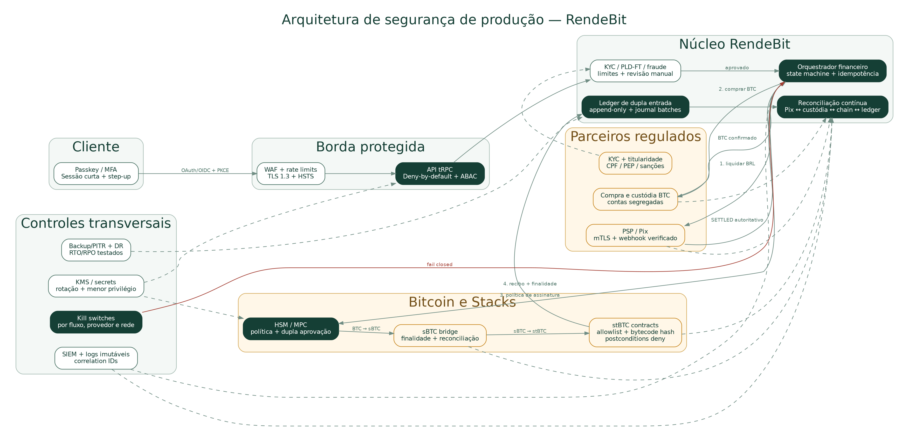

# Plano de segurança para produção da RendeBit

**Data-base:** 8 de setembro de 2026  
**Autor:** Manus AI  
**Status atual:** **NO-GO para BRL real, Pix de clientes, mainnet, custódia real e resgates**

## 1. Decisão executiva

A RendeBit deve adotar uma arquitetura de **defesa em profundidade**. Nenhum controle isolado será tratado como suficiente. OAuth, idempotência, preflight em testnet, postconditions em modo `deny`, cálculo de slippage com `bigint` e confirmação on-chain são bons fundamentos do sandbox, mas ainda não comprovam segurança para movimentar dinheiro ou ativos de clientes.

A rota recomendada para o primeiro lançamento é operar com **um parceiro regulado para Pix, compra e custódia de BTC**, mantendo na RendeBit a experiência do cliente, a orquestração, o ledger, a reconciliação e os controles de risco. A RendeBit não deve operar uma chave privada de produção em variável de ambiente. A assinatura de operações Stacks deve usar **HSM ou MPC com política independente, segregação de funções e dupla aprovação**. A Xverse pode permanecer como opção de autocustódia visível ao usuário, mas não deve ser usada como assinador automático de backend.

A prestação profissional de serviços com ativos virtuais no Brasil exige uma análise formal do perímetro regulatório. A Lei nº 14.478/2022 e a regulamentação do Banco Central devem orientar a definição da entidade operadora, dos parceiros e das responsabilidades. A classificação jurídica de BTC, sBTC e stBTC também deve ser validada antes da oferta. [1] [2] [3]

> **Regra inegociável:** a operação falha de forma fechada. Se identidade, liquidação Pix, custódia, contrato, destinatário, limite, confirmação on-chain ou reconciliação não estiverem comprovados, a RendeBit não credita, não converte, não assina e não paga.

## 2. Arquitetura de segurança recomendada

O fluxo financeiro será uma **máquina de estados explícita**. Cada etapa terá uma fonte autoritativa, uma chave de idempotência, uma evidência persistida e um procedimento de compensação. A sequência operacional será:

1. O usuário conclui autenticação forte, KYC, PLD-FT, confirmação de residência e titularidade da conta Pix.
2. O PSP confirma a liquidação Pix por canal autenticado e consulta autoritativa.
3. O custodiante compra e confirma o BTC em conta segregada.
4. A policy engine valida valor, rede, contrato, destinatário, limite, nonce, fee e slippage.
5. O serviço de assinatura em HSM/MPC autoriza a operação sBTC/stBTC sob dupla aprovação quando exigido.
6. O backend valida a finalidade on-chain e somente depois lança a posição no ledger.
7. Um reconciliador independente compara PSP, custodiante, Bitcoin, Stacks e ledger.

## 3. Protocolos que serão usados

| Camada | Protocolo ou padrão | Aplicação na RendeBit | Prioridade |
|---|---|---|---|
| Transporte | **TLS 1.3**, HSTS e **mTLS** com parceiros | Criptografar APIs; autenticar mutuamente RendeBit, PSP, custodiante e serviços críticos; rotacionar certificados antes da expiração | P0 |
| Identidade | **OAuth 2.0 Authorization Code + PKCE S256**, OpenID Connect e RFC 9700 | Validar `issuer`, `audience`, `azp`, assinatura, `state`, `nonce`, `exp`, `iat` e redirect URI exata; proibir implicit e password grant [9] | P0 |
| APIs financeiras | **FAPI 2.0**, quando suportado ou exigido | Usar PAR, clientes confidenciais, `private_key_jwt` ou mTLS e tokens vinculados ao remetente por mTLS ou DPoP [10] | P0 |
| Autenticação forte | **WebAuthn/passkeys** e piso equivalente a NIST AAL2 | Exigir step-up resistente a phishing para resgate, troca de conta, recuperação, administração e mudanças de limite [11] | P0 |
| Autorização | RBAC + ABAC, deny-by-default, maker-checker e PAM/JIT | Verificar usuário, tenant, ownership, estado, valor, risco e dispositivo em cada operação; ninguém move ativos ou altera ledger sozinho | P0 |
| Sessão | Cookie `Secure`, `HttpOnly`, escopo mínimo, sessão curta e revogável | Renovar após login e mudança de privilégio; idle timeout; timeout absoluto; encerramento remoto; não usar sessão de um ano em produção | P0 |
| API e aplicação | **OWASP ASVS 5.0**, nível 2 como base e nível 3 nos fluxos de custódia; **OWASP API Top 10:2023** | Testar BOLA, BFLA, mass assignment, SSRF, abuso de recursos, autenticação, autorização por propriedade e consumo inseguro de APIs [7] [8] | P0 |
| Pix | mTLS, assinatura de mensagens conforme PSP, verificação de webhook e proteção contra replay | O webhook não é liquidação. O backend consulta o PSP, confirma `endToEndId`, valor, titularidade, status e timestamp antes de avançar [6] | P0 |
| Idempotência | Inbox/outbox transacional, chaves únicas e máquina de estados monotônica | Retry com mesmos parâmetros retorna o mesmo efeito; conflito de parâmetros falha; eventos fora de ordem nunca retrocedem um estado liquidado | P0 |
| Contabilidade | **Partidas dobradas**, journal batches balanceados e registros append-only | Cada débito terá crédito correspondente por moeda e ativo; correções ocorrerão por reversão, nunca por edição destrutiva | P0 |
| Blockchain | Allowlist de chain ID, principal, função, ABI e hash do código; postconditions `deny` | Fixar contratos aprovados, valor e ativo; impedir transferências não previstas; revalidar mudanças de contrato e governança [14] | P0 |
| sBTC | Verificação do bridge, backing, signer set, depósitos, peg-out e finalização Bitcoin | Monitorar disponibilidade dos signatários, divergência entre supply e backing, confirmações, reorg e fila de peg [13] | P0 |
| stBTC | Ratio on-chain, `min-shares-out`, slippage, rate staleness, liquidez e resgate | Tratar stBTC como ativo distinto de BTC e sBTC; bloquear taxa inválida, contrato pausado, baixa liquidez ou principal não aprovado [15] | P0 |
| Chaves | **HSM ou MPC**, split knowledge, hot/warm/cold e KMS | Eliminar chave única em `.env`; usar chaves não exportáveis, política externa ao app, limites e recuperação testada [12] | P0 |
| Dados pessoais | Minimização, tokenização, envelope encryption e AES-256-GCM ou equivalente | Separar o cofre de identidade do domínio financeiro; não guardar CPF bruto em logs, URLs, analytics ou eventos; atender LGPD [4] | P0 |
| Observabilidade | Logs estruturados em UTC, correlation IDs, armazenamento imutável e SIEM | Correlacionar autenticação, Pix, custódia, assinatura, contratos e ledger sem registrar tokens, seeds ou PII | P0 |
| Engenharia | NIST SSDF, SAST, DAST, SCA, secret scanning, IaC scanning e pentest | Bloquear release com vulnerabilidade crítica ou alta nos fluxos de autenticação, dinheiro, custódia e ledger [16] | P0 |
| Supply chain | SBOM CycloneDX/SPDX, artefatos assinados e provenance SLSA | Fixar dependências, assinar build e verificar o digest antes do deploy; buscar SLSA Build L2 como mínimo inicial [18] | P1 |
| Continuidade | Backups imutáveis, PITR, DR, kill switches e NIST CSF/IR | Definir RTO/RPO por BIA; testar restore, failover e pausa por fluxo, provedor e rede [17] | P0 |

## 4. Custódia e assinatura

A conta de produção não deve ser controlada pelo processo Node.js. O backend poderá preparar uma intenção de transação, mas a assinatura deverá ocorrer em uma camada separada. Essa camada aplicará uma policy engine e enviará ao HSM/MPC somente operações aprovadas.

A policy engine deve validar o hash do contrato, a rede, a função Clarity, os argumentos, o ativo, o valor máximo, a postcondition, o nonce, a fee, o endereço de destino e o slippage. O payload aprovado e o payload assinado devem produzir o mesmo hash canônico. Alteração entre preflight e assinatura deve resultar em bloqueio.

A segregação recomendada é:

| Tier | Uso | Controles mínimos |
|---|---|---|
| Hot | Liquidez diária limitada | HSM/MPC, limites por transação e período, allowlist, velocity rules, monitoramento contínuo |
| Warm | Reposição operacional | Aprovação de duas pessoas, janela de espera, acesso just-in-time e reconciliação antes/depois |
| Cold | Reserva | Assinatura multilateral offline ou altamente isolada, cerimônia documentada e recuperação ensaiada |

O limite de cada tier deve ser aprovado por risco e tesouraria. Percentuais fixos não devem ser definidos antes da análise de volume, liquidez, seguro, tempo de reposição e perda máxima aceitável.

## 5. Pix, compra e resgate

A liquidação Pix deve ser confirmada por **estado autoritativo do PSP**. Um callback somente inicia a verificação. A RendeBit deve validar certificado, assinatura quando fornecida, timestamp, nonce, corpo bruto e proteção contra replay. Depois, deve consultar o PSP e comparar `endToEndId`, pagador, titularidade, valor, moeda e status.

A compra de BTC somente começa após o Pix estar liquidado e sem hold de fraude ou PLD-FT. O resgate deve aplicar a ordem inversa com saldo reservado, cotação transparente, name-match, limites, step-up de autenticação e confirmação da conta de mesma titularidade. O Mecanismo Especial de Devolução e qualquer estorno serão lançamentos compensatórios; nunca apagaremos o lançamento original.

## 6. Ledger e reconciliação

O ledger de produção será de **dupla entrada** e append-only. Ele representará separadamente BRL, BTC, sBTC, stBTC, taxas, spread, saldos pendentes, saldos disponíveis, reservas, custos de provedores e receita da organização. Um journal batch só será confirmado quando a soma dos débitos for igual à soma dos créditos por ativo.

A reconciliação será independente do orquestrador. Ela fará comparação intraday e fechamento diário entre:

| Fonte | Evidência |
|---|---|
| PSP/Pix | Evento, consulta de status e extrato de liquidação |
| Custodiante | Ordem, execução, posição, taxa e extrato |
| Bitcoin/sBTC | TXID, outputs, confirmações, backing e supply |
| Stacks/stBTC | TXID, bloco, eventos, ratio, saldo e contrato aprovado |
| RendeBit | Pedido, journal batch, subledger do cliente e estado da saga |

Qualquer diferença monetária não explicada bloqueia novas operações relacionadas. Ajustes manuais exigem maker-checker, justificativa, evidência e lançamento compensatório.

## 7. KYC, PLD-FT, LGPD e segurança do cliente

OAuth identifica uma sessão, mas não substitui KYC. Antes de operar, o cliente deve passar por CPF, documento, residência no Brasil, titularidade Pix, PEP, sanções, origem e finalidade dos recursos e análise de risco. Wallets e transações devem passar por monitoramento blockchain e regras de PLD-FT. O modelo e os reportes devem ser revisados por jurídico e compliance brasileiros. [1] [2]

A proteção de dados seguirá os princípios de finalidade, necessidade, segurança, prevenção e responsabilização da LGPD. A RendeBit deverá manter inventário de dados, base legal, RIPD/DPIA, política de retenção, direitos dos titulares, contratos com operadores e mecanismo válido para transferências internacionais. [4]

O plano de resposta deve suportar comunicação à ANPD no prazo regulatório aplicável quando o incidente puder causar risco ou dano relevante aos titulares. [5]

## 8. Controles já presentes e lacunas atuais

| Área | O que já existe no código | Lacuna antes de produção |
|---|---|---|
| OAuth | `state` com nonce e cookie one-time no callback | Sessão dura um ano; falta `jti`, revogação, idle timeout, rotação, step-up e validação estrita do `appId` da sessão |
| Autorização | `protectedProcedure` e `adminProcedure` | RBAC binário; falta autorização por objeto/valor/estado, PAM e maker-checker |
| Idempotência | Chaves únicas para cotações, compras, eventos e distribuição | Falta outbox durável para todas as fronteiras, TTL/escopo formal e replay adversarial em escala |
| Orquestração | Preflight → Pix → custódia → rendimento → liquidação | Provedores Pix/custódia ainda são sandbox; falha posterior ao Pix precisa de compensação e reconciliação formal |
| Stacks testnet | Principal testnet validado, ABI check, postcondition `deny`, slippage e confirmação | Signer ainda pode vir de chave privada em ambiente; falta HSM/MPC, deployment stBTC oficial validado e política de finalidade/reorg |
| Eventos de provedor | Tabela e deduplicação por idempotência | `signatureVerified` é gravado como `true` sem verificação real; isso deve ser corrigido antes de qualquer webhook real |
| Ledger | Entradas persistidas por cliente | O modelo atual não é dupla entrada: há créditos sem débitos correspondentes e sem `journalBatchId`; é bloqueador de produção |
| Sessão e HTTP | Cookie `HttpOnly` e `Secure` quando HTTPS | Falta CSP/Helmet, WAF, rate limit, limite de body por rota e CORS explícito; o limite global atual de 50 MB é excessivo |
| Tesouraria | Validação de endereço e aprovação administrativa sandbox | Um único admin pode aprovar; produção exige multisig/MPC, limites, dupla aprovação e política de distribuição separada de fundos de clientes |
| Testes | Unitários financeiros, provedores, orquestrador, branding e verificação de banco | Faltam testes de autorização, fuzz/property, concorrência pesada, webhook adversarial, pentest, DAST e DR |
| Observabilidade | Eventos persistidos em banco | Falta SIEM, logs imutáveis, redaction, alertas, SLOs, on-call e trilha completa de decisão |

## 9. Gates obrigatórios de go-live

| Gate | Critério de aprovação | Regra de bloqueio |
|---|---|---|
| G0 — Regulação | Parecer independente, entidade e responsabilidade definidas, autorização BCB aplicável ou parceiro autorizado contratado | Sem documento e decisão formal: **NO-GO** |
| G1 — Tokens | BTC, sBTC e stBTC classificados; contratos, direitos, governança, liquidez e resgate aprovados; gate CVM concluído | Token não classificado: **não listar** |
| G2 — Parceiros | PSP, KYC, custodiante, blockchain analytics e RPC homologados, com RACI, auditoria, SLA, incidentes e saída | Provedor sem due diligence: **não conectar** |
| G3 — Identidade | AAL2, passkey/step-up, sessão revogável e autorização por objeto/valor testadas | Bypass ou recuperação fraca: **NO-GO** |
| G4 — Pix | mTLS, webhook verificado, consulta autoritativa, titularidade, antifraude, MED, duplicidade e indisponibilidade testados | Crédito antes de `SETTLED`: **NO-GO** |
| G5 — Ledger | Partidas dobradas, append-only, journals balanceados e reconciliação com zero diferença inexplicada | Journal desbalanceado: **pausa automática** |
| G6 — Custódia | HSM/MPC, nenhum segredo exportável, dual control, allowlists, limites, rotação e recuperação testados | Chave única ou operador único: **NO-GO** |
| G7 — Contratos | Principals e hashes fixados; auditoria do adapter e contratos; postconditions; reorg/finality; kill switch | Achado crítico/alto aberto: **NO-GO** |
| G8 — AppSec | ASVS, API Top 10, SAST, DAST, SCA, secret scan e pentest independente com reteste | Crítico aberto ou alto em fluxo financeiro: **NO-GO** |
| G9 — LGPD | ROPA, bases legais, RIPD, retenção, direitos, encarregado, operadores e transferências aprovados | Dado sem finalidade/base/controle: **NO-GO** |
| G10 — Resiliência | Backups imutáveis, PITR, restore, failover, SIEM, on-call e exercícios de incidente aprovados | Restore não comprovado: **NO-GO** |
| G11 — Piloto | Limites baixos, poucos clientes, canary, reconciliação contínua e rollback | Divergência, fraude relevante ou bypass: **pausa imediata** |
| G12 — 2027 | Plano prudencial e regulatório aprovado para requisitos aplicáveis a partir de 2027 | Dívida regulatória sem plano: **não ampliar operação** |

## 10. Metas operacionais iniciais

Estas metas são propostas de engenharia. A análise de impacto no negócio deve confirmá-las antes do contrato de serviço.

| Métrica | Meta inicial |
|---|---|
| RPO do ledger e liquidação | Até 5 minutos; buscar RPO zero por journal/outbox e reconciliação |
| RTO do ledger e liquidação | Até 1 hora |
| RTO de funções não monetárias | Até 4 horas |
| Detecção de evento crítico | Alerta em até 5 minutos |
| Reconhecimento de incidente crítico | Até 15 minutos |
| Reconciliação | Intraday e fechamento diário; zero diferença monetária não explicada |
| Vulnerabilidades | Zero críticas; zero altas em autenticação, dinheiro, custódia, ledger ou superfície pública |
| Segredos | Zero seed/private key em código, CI, banco comum, logs ou backups não dedicados |
| Retenção de logs | Definida por requisitos legais, regulatórios, investigação e minimização LGPD; não usar prazo único sem matriz de dados |

## 11. Roadmap recomendado

### Fase 0 — Freeze e decisões

A RendeBit permanece em sandbox/testnet. O conselho aprova a estrutura regulatória, o modelo de custódia e o parceiro regulado. Engenharia fecha o threat model, o modelo de dados e a arquitetura de trust boundaries.

### Fase 1 — Endurecimento técnico

O time substitui o ledger por partidas dobradas, implementa state machines, inbox/outbox, reconciliação, AAL2, step-up, ABAC, rate limits, CSP, logs com redaction, SIEM, KMS/HSM e separação física de ambientes. O CI/CD recebe gates de segurança, SBOM e artefatos assinados.

### Fase 2 — Homologação real

Cada parceiro é integrado em ambiente de homologação. Os testes cobrem duplicidade, timeout, callback inválido, indisponibilidade, fraude, MED, reorg, contrato pausado, taxa anômala, chave comprometida e divergência de ledger. O pentest independente e os exercícios de DR são concluídos.

### Fase 3 — Piloto limitado

O piloto começa somente após G0 a G10. Ele usa limites conservadores, poucos clientes, allowlists, monitoramento reforçado e aprovação manual para ações de alto impacto. O aumento de limites depende de um período definido sem divergência financeira, bypass de autorização ou incidente crítico.

### Fase 4 — Produção progressiva

A operação cresce por canary. Qualquer novo token, contrato, provedor, cadeia, mudança de custódia ou aumento relevante de limite reabre o threat model e os gates correspondentes.

## 12. Prioridades imediatas no repositório

As próximas correções técnicas devem ocorrer nesta ordem:

1. Substituir o ledger atual por journal batches de dupla entrada e adicionar reconciliação automática.
2. Remover a chave Stacks de variáveis de ambiente da arquitetura de produção e criar uma interface de signer HSM/MPC.
3. Implementar sessões curtas, revogáveis, com `jti`, validação de `appId`, idle timeout e step-up.
4. Corrigir `signatureVerified`, que não pode ser marcado como verdadeiro sem verificação criptográfica real.
5. Adicionar Helmet/CSP/HSTS, limites por rota, rate limiting, proteção contra abuso e redaction de logs.
6. Implementar maker-checker para tesouraria, ajustes de ledger, whitelists, limites e distribuição de lucro.
7. Criar pipeline CI com check, testes, SAST, SCA, secret scan, SBOM e build assinado.
8. Criar threat model, runbook de incidentes, política de custódia, política de reconciliação e plano de continuidade versionados.

## 13. Conclusão

A segurança de produção da RendeBit não será baseada em esconder a mecânica técnica do usuário. A interface poderá ser simples, mas o backend deverá ser verificável, segregado, reconciliável e auditável. A inovação de experiência somente é sustentável se os controles de custódia, Pix, ledger, contratos, identidade, dados e continuidade forem tratados como requisitos de produto.

A recomendação é lançar primeiro com **parceiro regulado e custodiante**, mantendo as chaves de produção fora do processo da aplicação. A operação própria de custódia poderá ser considerada depois de volume, capital, equipe 24/7, HSM/MPC, auditoria e governança suficientes.

Este documento é um plano técnico e operacional. Ele não substitui parecer jurídico, regulatório, contábil, tributário ou de valores mobiliários.

## References

[1]: https://www.planalto.gov.br/ccivil_03/_ato2019-2022/2022/lei/l14478.htm "Lei nº 14.478/2022 — diretrizes e prestadoras de serviços de ativos virtuais"
[2]: https://www.bcb.gov.br/estabilidadefinanceira/exibenormativo?tipo=Resolu%C3%A7%C3%A3o%20BCB&numero=520 "Resolução BCB nº 520, de 10 de novembro de 2025"
[3]: https://www.bcb.gov.br/estabilidadefinanceira/exibenormativo?tipo=Resolu%C3%A7%C3%A3o%20BCB&numero=580 "Resolução BCB nº 580, de 1º de julho de 2026"
[4]: https://www.planalto.gov.br/ccivil_03/_ato2015-2018/2018/lei/l13709.htm "Lei Geral de Proteção de Dados — Lei nº 13.709/2018"
[5]: https://www.in.gov.br/en/web/dou/-/resolucao-cd/anpd-n-15-de-24-de-abril-de-2024-556243024 "Resolução CD/ANPD nº 15/2024 — comunicação de incidentes de segurança"
[6]: https://bcb.gov.br/content/estabilidadefinanceira/cedsfn/Manual%20de%20Seguran%C3%A7a%20do%20SFN%20-%20Vol.II%20-%20v6_00.pdf "Banco Central — Manual de Segurança do SFN, Volume II, versão 6.00"
[7]: https://owasp.org/www-project-application-security-verification-standard/ "OWASP Application Security Verification Standard 5.0.0"
[8]: https://owasp.org/API-Security/editions/2023/en/0x11-t10/ "OWASP API Security Top 10:2023"
[9]: https://www.rfc-editor.org/rfc/rfc9700.html "RFC 9700 — Best Current Practice for OAuth 2.0 Security"
[10]: https://openid.net/specs/fapi-security-profile-2_0-final.html "OpenID FAPI 2.0 Security Profile — Final"
[11]: https://pages.nist.gov/800-63-4/sp800-63b.html "NIST SP 800-63B-4 — Authentication and Authenticator Management"
[12]: https://csrc.nist.gov/pubs/sp/800/57/pt1/r5/final "NIST SP 800-57 Part 1 Revision 5 — Recommendation for Key Management"
[13]: https://docs.stacks.co/learn/sbtc/security-model-of-sbtc "Stacks Documentation — Security Model of sBTC"
[14]: https://docs.stacks.co/post-conditions/overview "Stacks Documentation — Post-Conditions Overview"
[15]: https://docs.stackingdao.com/stackingdao/core-contracts/stbtc-stacking-dao-core "StackingDAO Documentation — stBTC Stacking DAO Core"
[16]: https://csrc.nist.gov/pubs/sp/800/218/final "NIST SP 800-218 — Secure Software Development Framework 1.1"
[17]: https://nvlpubs.nist.gov/nistpubs/CSWP/NIST.CSWP.29.pdf "NIST Cybersecurity Framework 2.0"
[18]: https://slsa.dev/spec/v1.2/ "SLSA Specification version 1.2"
